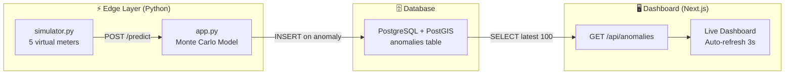

# GridMind — Complete Project Walkthrough

## Final Project Structure

```
aiForBharat/
├── edge-model/                    ← Python Edge-AI
│   ├── app.py                     ← Flask API (Monte Carlo detector)
│   ├── db.py                      ← PostgreSQL+PostGIS helper
│   ├── simulator.py               ← Demo data generator (5 Bangalore meters)
│   ├── requirements.txt           ← 4 packages (flask, psycopg2-binary, python-dotenv, requests)
│   └── .env                       ← DB connection config
│
├── database/
│   └── init.sql                   ← Schema (anomalies table + PostGIS + indexes)
│
├── dashboard/                     ← Next.js 14 Frontend
│   ├── app/
│   │   ├── layout.js              ← Root layout with SEO meta
│   │   ├── page.js                ← Live dashboard (polls every 3s)
│   │   ├── globals.css            ← Dark glassmorphism theme
│   │   └── api/anomalies/route.js ← REST API → PostgreSQL
│   ├── lib/db.js                  ← PG connection pool
│   ├── .env.local                 ← DB config for Next.js
│   └── package.json               ← next, react, pg
│
└── docker-compose.yml             ← Spins up PostGIS 16
```

---

## How to Run (3 Terminals)

### Prerequisites
- **Docker Desktop** running (for PostgreSQL)
- **Python 3.8+** installed
- **Node.js 18+** installed

### Terminal 1 — Start the Database

```bash
cd aiForBharat
docker compose up -d
```

Wait ~5 seconds for PostGIS to initialize. Verify:
```bash
docker exec gridmind-db psql -U gridmind -d gridmind -c "\dt"
```
You should see the `anomalies` table.

### Terminal 2 — Start the Edge Model

```bash
cd aiForBharat\edge-model
pip install -r requirements.txt
python app.py
```

You should see: `⚡ GridMind Edge-AI starting on http://0.0.0.0:5000`

### Terminal 3 — Start the Simulator

```bash
cd aiForBharat\edge-model
python simulator.py
```

You'll see a stream of readings. Every ~18 readings per meter, it injects an anomaly. The Edge-AI catches it and pushes to the DB.

### Terminal 4 — Start the Dashboard

```bash
cd aiForBharat\dashboard
npm run dev
```

Open **http://localhost:3000** — you'll see anomaly alerts appearing in real-time!

---

## Architecture Diagram



---

## Key Files Explained

### [app.py] — The Brain
- **What it kept from original**: The Monte Carlo frequency-based approach (`defaultdict` counting kWh frequencies)
- **What it fixed**: The original `app.py` had a critical bug — `count` was a local variable inside `predict()`, meaning it reset to 0 on every request, so every value always had `freq = 1.0` and nothing was ever flagged. The new version uses module-level `total_count` dict tracked per meter.
- **What it added**: Per-meter isolation, warm-up period (20 readings), auto-push to PostgreSQL via `db.py`

### [simulator.py] — The Demo Engine
- 5 meters with Bangalore coordinates
- Normal readings: Gaussian noise around each meter's baseline (3.2–7.5 kWh range)
- Anomalies injected every ~18 readings: extreme drops (0.01 kWh = theft) or spikes (99.9 kWh = tampering)

### [page.js] — The Dashboard
- Polls `/api/anomalies` every 3 seconds
- Shows: Total alerts, flagged meters, latest alert time
- Table: timestamp, meter ID, kWh, severity badge with pulsing dot, confidence bar, coordinates
- HIGH severity rows highlighted in red with left border

### [init.sql] — The Schema
- PostGIS extension enabled
- `GEOMETRY(Point, 4326)` column for spatial coordinates
- Indexes on `created_at` (DESC for fast latest-first queries) and `meter_id`

---
